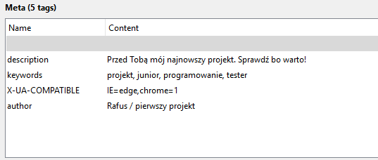

## Project Name
>My first webpage <BR>
 
### Table of contents
* [General info](#general-info)
* [Screenshots](#screenshots)
* [Setup](#setup)
* [Status](#status)
* [Inspiration](#inspiration)
* [Contact](#contact)

### General info
My first HTML&CSS project  #PL <br /> Basic understanding of HTML. I'm  still learning. 

### Screenshots


### Setup
See on [GitHub Page](https://rafu7s.github.io/First-project-internal-inline/)
 
### Status
Project is:
>for testing purposes /inline-internal style/ <br>
I used 1920x1200 monitor for project
<!-- in development (low priority)
>more CSS + JS coming soon....-->

### Inspiration
Project inspired by:
- Pasja informatyki "HTML course" video (HTML)
- w3schools.com (HTML&CSS)
- flynerdpl (Template for a README)

### Contact
Created by [@Rafu7s](mailto:rafusv2@gmail.com) - feel free to contact me!
<br><br>

<br><br>
keywords: HTML, CSS, JS, PHP, JQuery, Sketch, Node.js, Angular.js, WebGL, D3

<br><br><br>
---------------------
### Notes
- CSS
```
# - id
. - class
text-align,font-size,color,background,font-weight/style/decoration,margin/padding,width/height,display,float,clear
#top>#logo>#menu-top->#main>#left,#body>h1,#content->#footer
```
- Internal
```
<style>...</style> (w head)
```
- Head
```
<link rel="stylesheet" href="*.css">
<script src="*.js" type="..."></script>
<meta charset/name(decription/keywords)>
<title>
```
- Body
```
element blokowy:<div>
akapit:<p>
listy:punktowe<ul>/numerowane<ol>:<li>
nagłówki:<h1,h2>
tabela:<table>(<tr><td/th>colspan/rowspan,border)
formularze:<form>method,action|pole tekstowe<input>:type(text,<label>radio,checkbox>checked,submit/button),name,value,placeholder<textarea>:cols,rows<button><select>
znacznik:<a(hiperlacze:href)>
, <hr>, <br>, <video>, <audio>, <script>
komentarz: <!--...-->
```
